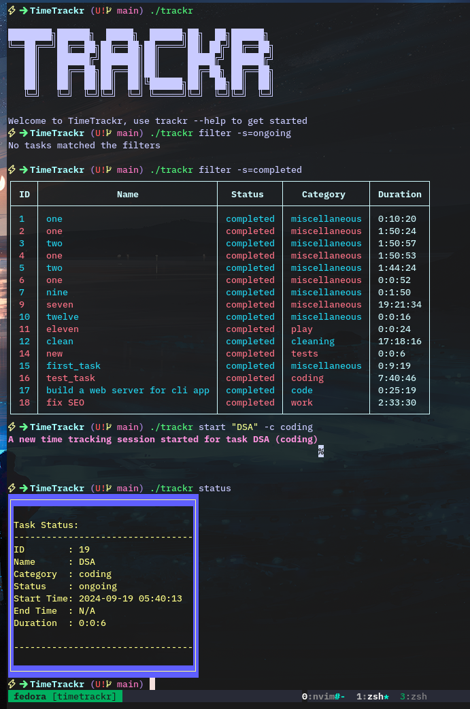
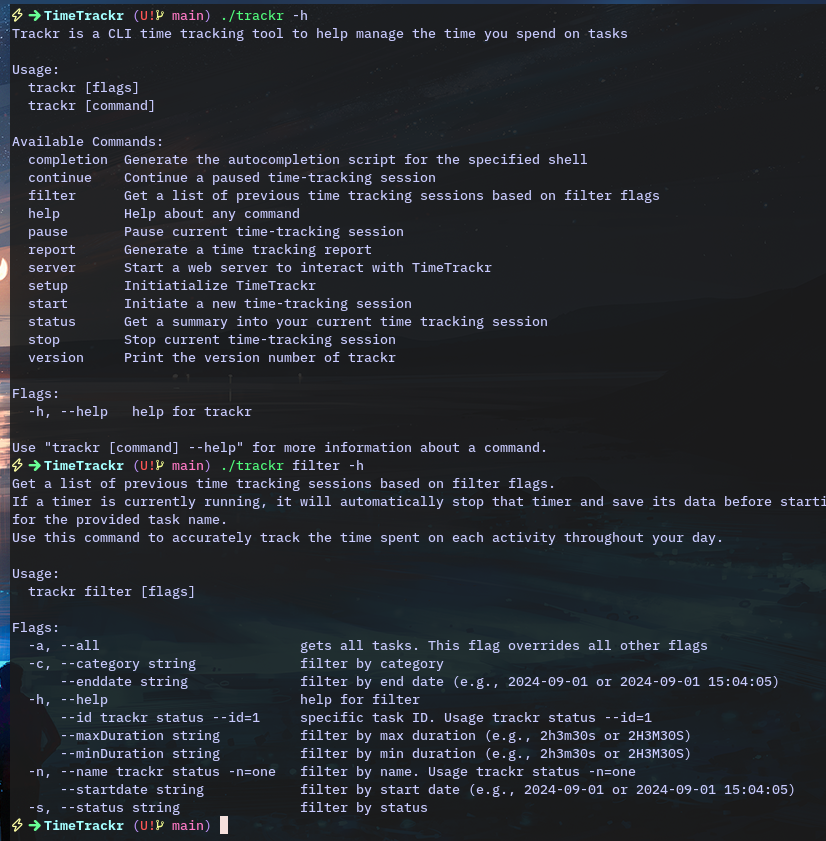
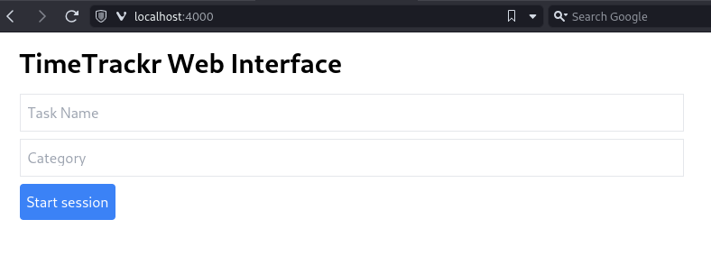

# TimeTrackr CLI

TimeTrackr is a command-line application build with GO and designed to help users manage their time effectively by tracking tasks, generating reports, and providing insights into their productivity.





## Introduction

TimeTrackr is a command-line application that allows users to log their time spent on various tasks throughout the day. Whether you are a developer, student, or freelancer, this tool will help you stay on top of your time management, enabling you to improve productivity by analyzing how you spend your time.

**Features:**

- Track time spent on different tasks.
- Categorize tasks for better organization.
- Generate detailed time reports for a specified period.
- Easily edit or delete task entries.
- See real-time status of your current task.

For more information and the latest updates, visit the deployed version or read the final project blog:

- **Deployed Site:** [link to deployed app]
- **Project Blog:** [link to blog]
- **Author's LinkedIn:** [Your LinkedIn profile]

## Installation

To install and run TimeTrackr on your local machine:

1. Ensure that [Go](https://golang.org/dl/) is installed.
2. Clone the repository:
   ```bash
   git clone https://github.com/yourusername/timetrackr.git
   cd timetrackr
   ```
3. Install the dependencies:
   ```bash
   go mod download
   ```
4. Build the project:
   ```bash
   go build -o trackr
   ```
5. Run the application:
   ```bash
   ./trackr
   ```

## Usage

Once installed, you can start using TimeTrackr by running the following commands from you terminal:

- Start a new time tracking session:

```bash
./trackr start "Task Name" --catergory "Work"
```

- Stop the current or a paused time tracking session:

```bash
./trackr stop "Task Name"
```

- Check the status of the current time tracking session

```bash
./trackr status
```

- Generate a report

```bash
./trackr report --startdate="2024-09-10 08:30 AM" --enddate="2024-09-15 03:05 PM"
```

For a full list of commands, use:

```bash
./trackr --help
```

## Contributing

Contributions are welcome! To contribute:

1. Fork the repository.
2. Create a new feature branch.
3. Commit your changes.
4. Push your branch and create a pull request.

## License

This project is licensed under the MIT License - see the LICENSE file for details
